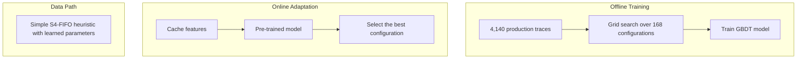

# S4-FIFO

This repository contains the artifacts for the paper  
**“Learning-Augmented Heuristics: Simple, Smart, Robust, and Interpretable Cache Eviction.”**

  

## Learning-Augmented Heuristics Framework

## S4-FIFO Algorithm

S4-FIFO is a learning-augmented cache eviction algorithm that combines a simple FIFO-based data path with an offline-trained model for adaptive parameter selection.

Key components include:

* **Three FIFO queues**: Small, Main, and Ghost
* **Five learnable parameters**: skip ratio, queue sizes, and promotion thresholds
* **Seventy-three features**: cache metrics and workload characteristics
* **GBDT model**: trained on 4,140 production traces with an 18-class output space

## Artifact Evaluation

For simulator-based experiments, see [`libCacheSim`](./libCacheSim/).

For real-cache experiments, see [`CacheLib`](./CacheLib/).

## License

This project is licensed under the Apache License 2.0.

See [`LICENSE`](./LICENSE) for details.

## Support

For questions or issues:

1. Check the [troubleshooting section in `REPRODUCTION.md`](doc/REPRODUCTION.md#troubleshooting).
2. Open a GitHub issue with detailed steps to reproduce the problem.
