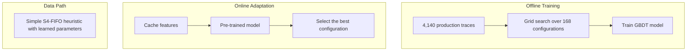

# S4-FIFO: Learning-Augmented Heuristics for Cache Eviction

---

## Overview

S4-FIFO introduces **Learning-Augmented Heuristics (LAH)**, a framework that augments simple cache eviction heuristics with offline-trained machine learning models. Unlike prior learning-based caches that make per-object decisions at admission or eviction time, S4-FIFO decouples the data path from the control path: a simple FIFO-based heuristic handles all admission and eviction decisions, while a pre-trained GBDT model periodically selects the best configuration based on cache-level workload features.

This artifact contains the complete implementation used in the paper, including the libCacheSim-based simulator, Meta CacheLib integration, model training pipeline, and all analysis scripts. The key results are: **+26% mean efficiency improvement** over S3-FIFO, **+8% over 3L-Cache**, and a worst-case miss ratio increase of only **0.8%** versus plain FIFO (compared to 3L-Cache's 8.8%). The system achieves throughput parity with traditional heuristics while providing clear interpretability through five operational parameters.

<div style="text-align: center;">
  
</div>

## Quick Start

```bash
# Clone with submodules
git clone --recursive https://github.com/cacheMon/osdi26-s4-fifo.git
cd osdi26-s4-fifo

# Build libCacheSim with S4-FIFO support
cd libCacheSim && mkdir build && cd build
cmake .. -DCMAKE_BUILD_TYPE=Release -DENABLE_TESTS=OFF
make -j$(nproc)

# Run a quick experiment using the included sample trace
./bin/cachesim ../data/cloudPhysicsIO.vscsi vscsi s4fifo 1GB -n 100000
```

For Docker-based setup, see [Building with Docker](#building-with-docker).

## Repository Structure

| Directory | Description |
|-----------|-------------|
| `libCacheSim/` | Cache simulator with S4-FIFO, s4fifo-base, and s4fifo-verify implementations |
| `CacheLib/` | Meta CacheLib integration with S4-FIFO for real-cache experiments |
| `analysis/` | Model training scripts (XGBoost), feature analysis, and plotting |
| `doc/` | Diagrams, documentation, and the full reproduction guide |

## Building

### Prerequisites

- gcc/g++ 11 or newer
- cmake 3.12 or newer
- libglib2.0-dev
- libgoogle-perftools-dev
- libzstd-dev

On Ubuntu/Debian:

```bash
sudo apt install build-essential cmake libglib2.0-dev libgoogle-perftools-dev libzstd-dev
```

### Build libCacheSim

```bash
cd libCacheSim
mkdir build && cd build
cmake .. -DCMAKE_BUILD_TYPE=Release -DENABLE_TESTS=OFF
make -j$(nproc)
```

The `cachesim` binary will be at `libCacheSim/build/bin/cachesim`.

### Building with Docker

```bash
docker build -t s4fifo .
docker run -it s4fifo bash
# Inside the container, cachesim is pre-built and on PATH
cachesim libCacheSim/data/cloudPhysicsIO.vscsi vscsi s4fifo 1GB
```

### Build CacheLib (Advanced)

The `CacheLib/` submodule contains a fork with S4-FIFO integrated for real-cache throughput evaluation using CacheBench. Building CacheLib requires Meta's `getdeps.py` build system, which compiles many dependencies from source (folly, fizz, wangle, etc.). Build time is typically 30–60 minutes.

```bash
# Install system dependencies
sudo python3 ./CacheLib/build/fbcode_builder/getdeps.py install-system-deps --recursive cachelib

# Build CacheLib with S4-FIFO
python3 ./CacheLib/build/fbcode_builder/getdeps.py build \
  cachelib \
  --no-tests \
  --build-type=RelWithDebInfo \
  --src-dir="./CacheLib" \
  --scratch-path="./CacheLib/deps" \
  --install-dir="./CacheLib/opt"

# Run throughput experiments
cd CacheLib
python3 runner.py ./config_hit_ratio_longer
```

Pre-built benchmark results are in `CacheLib/results_benchmark/`. For faster experimentation, use the libCacheSim simulator instead.

## Running Experiments

### Basic Usage

```bash
# S4-FIFO (learning-augmented)
./bin/cachesim ../data/cloudPhysicsIO.vscsi vscsi s4fifo 1GB

# Compare against baselines
./bin/cachesim ../data/cloudPhysicsIO.vscsi vscsi lru 1GB
./bin/cachesim ../data/cloudPhysicsIO.vscsi vscsi fifo 1GB
./bin/cachesim ../data/cloudPhysicsIO.vscsi vscsi s3fifo 1GB
./bin/cachesim ../data/cloudPhysicsIO.vscsi vscsi sieve 1GB
./bin/cachesim ../data/cloudPhysicsIO.vscsi vscsi arc 1GB
```

All commands should be run from the `libCacheSim/build/` directory.

### Supported Trace Formats

| Format Flag | Description |
|-------------|-------------|
| `vscsi` | VMware vscsi traces |
| `oracleGeneralBin` | Oracle general binary format |
| `csv` | CSV with object ID, size, and optional op type |
| `txt` | Plain text (one object ID per line) |
| `twr` | Twitter trace format |

### S4-FIFO Parameters

Parameters can be set via the `-e` flag:

| Parameter | Description | Default |
|-----------|-------------|---------|
| `small-size-ratio` | Fraction of cache for the small queue | 0.10 |
| `ghost-size-ratio` | Ghost queue size as multiple of cache | 0.90 |
| `move-to-main-threshold` | Hits before promoting to main queue | 2 |
| `small-skip-ratio` | Skip ratio for small queue frequency update | 0 |
| `ghost-to-main-threshold` | Ghost hits before admitting to main | 0 |

Example with custom parameters:

```bash
./bin/cachesim trace.vscsi vscsi s4fifo 1GB \
  -e "small-size-ratio=0.20,ghost-size-ratio=6,move-to-main-threshold=1"
```

## Reproducing Paper Results

The full reproduction guide is in [`doc/REPRODUCTION.md`](doc/REPRODUCTION.md). It covers ten phases:

1. **Dataset Preparation** -- Acquire and validate 5,175 production traces from 14 sources
2. **Parameter Search & Features** -- Grid search 168 configurations, extract 73 features per trace
3. **Model Training** -- Train cost-sensitive GBDT (LightGBM, 18-class output)
4. **Simulation Experiments** -- Compare S4-FIFO against 8 baselines across all traces
5. **Robustness Analysis** -- Worst-case miss ratio regression versus FIFO
6. **Throughput Evaluation** -- Benchmark throughput parity with traditional heuristics
7. **Ablation Studies** -- Feature importance, parameter sensitivity, and model complexity
8. **Real-Cache Experiments** -- CacheLib integration with production workloads
9. **Interpretability Analysis** -- Parameter operational semantics and decision boundaries
10. **Cross-Source Generalization** -- Leave-one-source-out evaluation

Each phase includes estimated runtime, required resources, and expected outputs.

## Analysis & Model Training

The `analysis/` directory contains:

- **Feature extraction**: Scripts to compute the 73-dimensional feature vector from cache traces (histogram features, queue hit ratios, composite features)
- **Model training**: LightGBM training pipeline with custom cost-weighted classification
- **Configuration discretization**: Greedy set cover algorithm reducing 168 candidate configurations to 18 representative classes
- **Plotting**: Scripts to generate all figures from the paper

See [`analysis/README.md`](analysis/README.md) for details.

## Supported Algorithms

The simulator includes the following eviction algorithms:

| Algorithm | Description |
|-----------|-------------|
| `s4fifo` | S4-FIFO with learning-augmented parameter selection |
| `s4fifo-base` | S4-FIFO with default parameters (no ML) |
| `s4fifo-verify` | S4-FIFO with oracle parameter selection (upper bound) |
| `lru` | Least Recently Used |
| `fifo` | First In First Out |
| `arc` | Adaptive Replacement Cache |
| `s3fifo` | S3-FIFO (S4-FIFO predecessor) |
| `sieve` | Sieve cache |
| `lecar` | LRU-LFU adaptive cache |
| `lfu` | Least Frequently Used |
| `belady` | Belady's optimal offline algorithm (oracle bound) |

## S4-FIFO Algorithm

S4-FIFO is a learning-augmented cache eviction algorithm that combines a simple FIFO-based data path with an offline-trained model for adaptive parameter selection.

Key components include:

- **Three FIFO queues**: Small, Main, and Ghost
- **Five learnable parameters**: skip ratio, queue sizes, and promotion thresholds
- **Seventy-three features**: cache metrics and workload characteristics
- **GBDT model**: trained on 4,140 production traces with an 18-class output space



## Troubleshooting

**Missing submodules**: If `libCacheSim/` appears empty after cloning, run:
```bash
git submodule update --init --recursive
```

**Build errors with cmake**: Ensure cmake >= 3.12 and gcc/g++ >= 11. Check with `cmake --version` and `g++ --version`.

**Trace format not recognized**: Verify the trace type flag matches the file format. Use `oracleGeneralBin` for binary traces from the CDN/block storage datasets, and `vscsi` for VMware traces.

**Permission denied on cachesim**: Ensure the binary is executable: `chmod +x libCacheSim/build/bin/cachesim`.

**Out of memory during grid search**: The full 168-configuration grid search over 4,140 traces requires significant RAM. Start with a subset of traces or configurations, and scale up.

## License

This project is licensed under the [Apache License 2.0](LICENSE).

## Citation

```bibtex
@inproceedings{xia2026s4fifo,
  title     = {Learning-Augmented Heuristics: Simple, yet Smart, Robust and Interpretable Cache Eviction},
  author    = {Xia, Haocheng and Nixon, William and Marthen, Bintang Dwi and Bhandari, Pranav and Yang, Juncheng},
  booktitle = {Proceedings of the 17th USENIX Symposium on Operating Systems Design and Implementation (OSDI)},
  year      = {2026}
}
```
